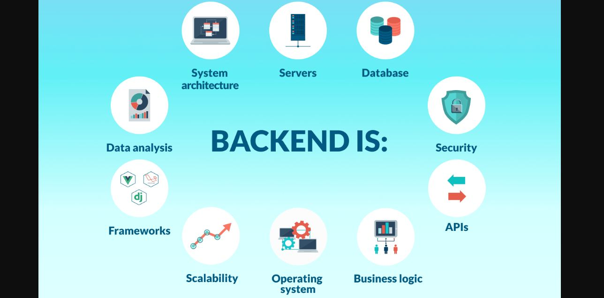

# Hi, I'm Sassi Hamdi! 👋 

## 🚀 About Me
I'm a Software Engineer Specializing on Back-End

 
- 🌱 I’m currently learning big complex system design
- 👯 I’m looking to collaborate on back-end projects
- 💬 Ask me about back-end engineering
- 📫 How to reach me: hamdysassy7@gmail.com

## 🔗 Links

## 🛠 Skills

Programming languages:
+ Java, JavaScript, Python, C/C++, C#

Web frameworks:
+ SpringBoot, Django, Node.js,

DevOps skills:
+  Git, Jenkins, Docker, and Kubernetes.

Database skills: 
MySQL, PostgreSQL, or MongoDB

Cloud computing:
+ AWS, Azure, Google Cloud, PaaS, SaaS, IaaS,

API design:
 + RESTful APIs

## Support

For support, email Hamdysassy7@gmail.com or join me Linkdin.

              
